# End-to-End DevOps CI/CD Project on AWS using Terraform, Jenkins, Docker, Kubernetes, Prometheus & Grafana

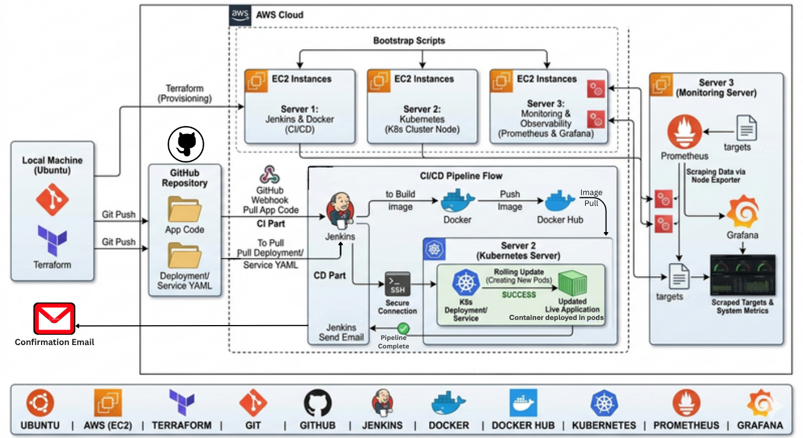

---

# Project Overview

This project demonstrates a complete end-to-end DevOps CI/CD pipeline built using open-source and cloud-native tools.

The project automates:

- Infrastructure provisioning
- Application containerization
- CI/CD pipeline execution
- Docker image management
- Kubernetes deployment
- Monitoring and visualization
- Build notifications

The complete infrastructure was provisioned on AWS EC2 instances using Terraform.

---

# Complete Project Flow

```text
Code on Local Machine
            ↓
Code Pushed to GitHub using Git
            ↓
Terraform Used to Provision AWS Infrastructure
            ↓
3 EC2 Instances Created:
   - Jenkins Server
   - Kubernetes Server
   - Monitoring Server
            ↓
Bootstrap Scripts Install Required Tools
            ↓
GitHub Webhook Triggers Jenkins Pipeline
            ↓
Jenkins Clones Latest Application Code
            ↓
Docker Image Build Starts
            ↓
Docker Image Pushed to DockerHub
            ↓
Jenkins Clones Kubernetes Manifest Repository
            ↓
Jenkins Updates Image Tag in deployment.yaml
            ↓
Updated Kubernetes Manifest Applied on K8s Server
            ↓
Rolling Update Creates New Pods
            ↓
Application Gets Updated Automatically
            ↓
Prometheus Scrapes Infrastructure Metrics
            ↓
Grafana Visualizes Monitoring Dashboards
            ↓
Jenkins Sends Build Status Email Notifications
```

---

# Tech Stack


| Category                | Tools                 |
| ----------------------- | --------------------- |
| Cloud Provider          | AWS EC2               |
| Infrastructure as Code  | Terraform             |
| CI/CD                   | Jenkins               |
| Containerization        | Docker                |
| Container Registry      | DockerHub             |
| Container Orchestration | Kubernetes (Minikube) |
| Monitoring              | Prometheus            |
| Visualization           | Grafana               |
| Alerts                  | Gmail SMTP            |
| Code Repository         | GitHub                |
| Version Control         | Git                   |

---

# Repository Structure

```text
end-to-end-devops-project/
│
├── terraform/
│   ├── jenkins-server/
│   │      ├── main.tf
│   │      ├── variables.tf
│   │      └── install.sh
│   │
│   ├── k8s-server/
│   │      ├── main.tf
│   │      ├── variables.tf
│   │      └── install.sh
│   │
│   └── monitoring-server/
│          ├── main.tf
│          ├── variables.tf
│          └── install.sh
│
├── k8s-manifests/
│      ├── deployment.yaml
│      └── service.yaml
│
├── Jenkinsfile
│
├── screenshots/
│
└── README.md
```

---

# Infrastructure Provisioning using Terraform

Terraform was used to provision multiple AWS EC2 instances.

Provisioned infrastructure:

- Jenkins Server
- Kubernetes Server
- Monitoring Server

## Example Terraform Configuration

```hcl
provider "aws" {
  region = var.aws_region
}

resource "aws_instance" "jenkins_server" {
  ami           = "ami-xxxxxxxx"
  instance_type = "t3.micro"
  key_name      = var.key_name

  tags = {
    Name = "jenkins-server"
  }
}
```

---

# AWS Infrastructure

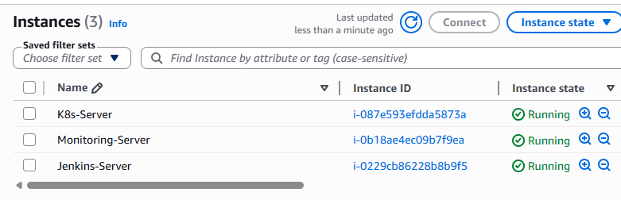

---

# Automated Server Setup using install.sh

Bootstrap scripts were used to automate package installation and server configuration.

The scripts installed:

- Java
- Jenkins
- Docker
- NodeJS
- kubectl
- Minikube
- Prometheus
- Grafana
- Node Exporter

This reduced manual setup effort and improved reproducibility.

---

# Jenkins CI/CD Pipeline

The Jenkins pipeline performs the following operations:

1. Clean Workspace
2. Clone Application Repository
3. Build Docker Image
4. Push Docker Image to DockerHub
5. Clone Kubernetes Manifest Repository
6. Update Docker Image Tag in deployment.yaml
7. Deploy Updated Manifest to Kubernetes
8. Send Email Notifications

## Jenkins Pipeline Snippet

```groovy
stage('Update Deployment YAML') {
    steps {

        dir('k8s-manifests') {

            sh """
            sed -i 's|image:.*|image: $IMAGE_NAME:$IMAGE_TAG|' deployment.yaml
            """

            sh 'cat deployment.yaml'
        }
    }
}
```

---

# Jenkins Pipeline Success

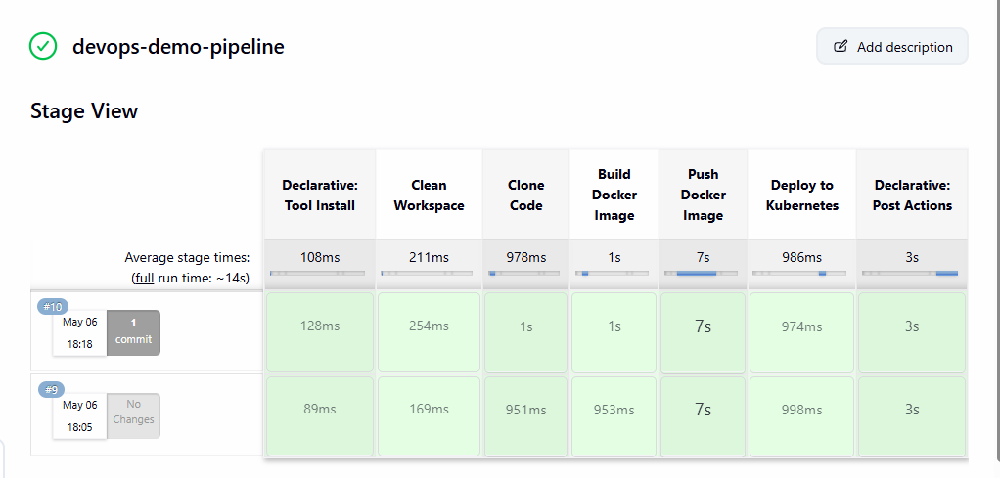

---

# Docker Image Build and Push

Docker was used to containerize the application.

Each Jenkins build generated a unique Docker image tag using Jenkins build numbers.

Example:

```text
shikhardevops/devops-demo-app:5
shikhardevops/devops-demo-app:6
```

This maintained image version history and enabled rollback capability.

---

# DockerHub Images

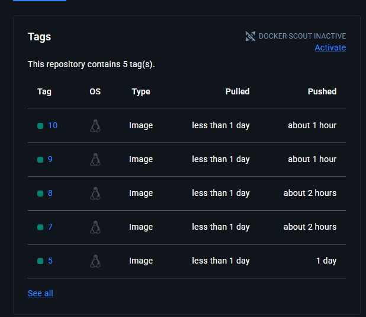

---

# Kubernetes Deployment

The application was deployed on Kubernetes using Minikube hosted inside an AWS EC2 instance.

Kubernetes manifests used:

- deployment.yaml
- service.yaml

## deployment.yaml

```yaml
apiVersion: apps/v1
kind: Deployment

metadata:
  name: devops-demo-deployment

spec:
  replicas: 2

  selector:
    matchLabels:
      app: devops-demo

  template:
    metadata:
      labels:
        app: devops-demo

    spec:
      containers:
      - name: devops-demo-container
        image: shikhardevops/devops-demo-app:latest

        ports:
        - containerPort: 80
```

---

## service.yaml

```yaml
apiVersion: v1
kind: Service

metadata:
  name: devops-demo-service

spec:
  type: NodePort

  selector:
    app: devops-demo

  ports:
    - port: 80
      targetPort: 80
      nodePort: 30007
```

---

# Kubernetes Commands Output

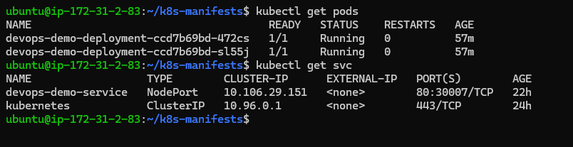

---

# Accessing Application Output

Since Minikube was hosted inside an EC2 instance, external application access required Kubernetes port-forwarding.

## Port Forward Command

```bash
kubectl port-forward service/devops-demo-service 8081:80 --address 0.0.0.0
```

## Access URL

```text
http://<K8S_PUBLIC_IP>:8081
```

---

# Application Output

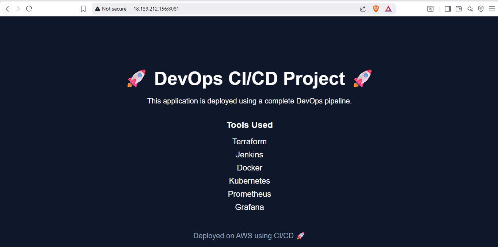

---

# Monitoring Setup

The monitoring stack consisted of:

- Node Exporter
- Prometheus
- Grafana

## Monitoring Flow

```text
Linux Server
    ↓
Node Exporter
    ↓
Prometheus
    ↓
Grafana Dashboard
```

Prometheus scraped metrics from:

- Jenkins Server
- Kubernetes Server
- Node Exporter

---

# Prometheus Targets

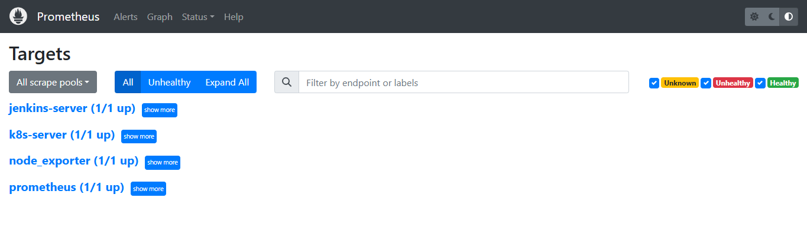

---

# Grafana Dashboards

## Jenkins Server Monitoring

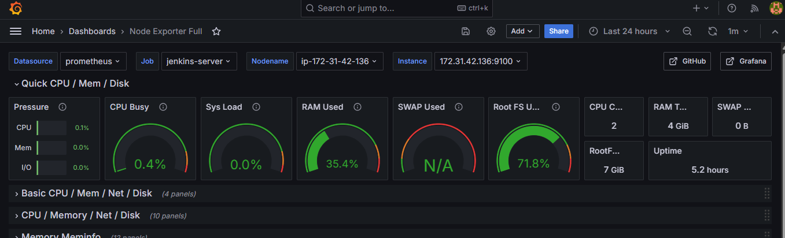

---

## Kubernetes Server Monitoring

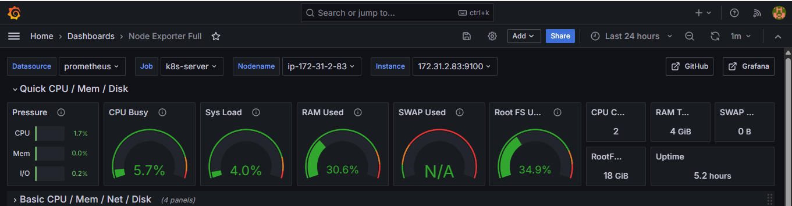

---

## Node Exporter Metrics

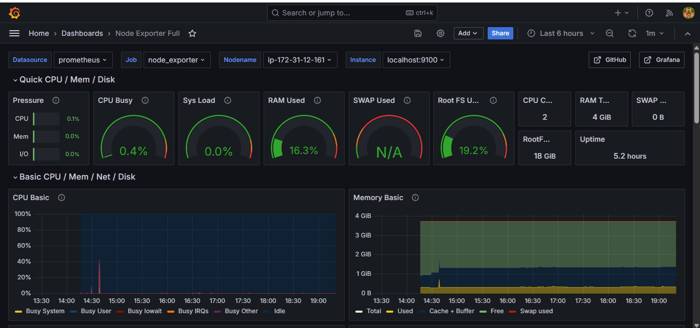

---

# Email Notifications

Jenkins email notifications were configured using Gmail SMTP.

Notifications were sent automatically for:

- Successful builds
- Failed builds

---

# Build Success Mail

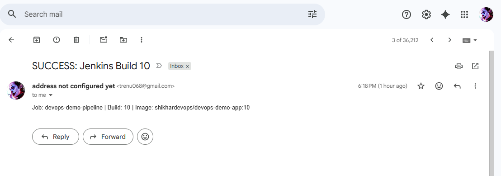

---

# Challenges Faced During the Project

## 1. Jenkins Could Not Access Kubernetes API

### Problem

Minikube used internal networking:

```text
192.168.x.x
```

which was not directly accessible externally from Jenkins.

### Solution

Implemented SSH-based deployment where Jenkins remotely executed Kubernetes deployment commands on the Kubernetes server.

---

## 2. Gmail SMTP Connection Issues

### Problem

SMTP SSL configuration initially caused email connection failures.

### Solution

Configured Gmail SMTP using:

- TLS
- Port 587
- Gmail App Password

---

## 3. NodePort Accessibility Issue

### Problem

NodePort was not directly accessible externally due to Minikube networking behavior on EC2.

### Solution

Used:

```bash
kubectl port-forward
```

to expose the application externally.

---

## 4. Kubernetes Manifest Version Management

### Problem

Initially deployment.yaml existed only on the Kubernetes server, making deployments difficult to track and version control.

### Solution

Created a dedicated GitHub repository for Kubernetes manifests. Jenkins dynamically updated deployment.yaml with the latest Docker image tag before deployment.

---

# Final Outcome

This project successfully demonstrated:

- Infrastructure provisioning using Terraform
- CI/CD automation using Jenkins
- Docker containerization
- Kubernetes deployment automation
- Automated image versioning
- Monitoring using Prometheus and Grafana
- Email notification integration
- GitHub webhook integration
- Rolling deployments in Kubernetes
- Infrastructure reproducibility using bootstrap scripts

---

# Application Repository

Application Source Code Repository:

```text
https://github.com/Shikhar-T/devops-demo-app.git
```

---

# Kubernetes Manifest Repository

Kubernetes Manifest Repository:

```text
https://github.com/YOUR_GITHUB_USERNAME/k8s-manifests
```

---

# Author

Shikhar Tiwari
